# Cultivador de Marihuana
En esta sección, encontrarás toda la información relacionada con la fabricación y la distribución de Marihuana.

## Preparativos
Lo primero que debemos tener para ser Cultivadores de Marihuana es un espacio bastante grande. Además, necesitaremos una `Tablet` para poder comprar todos los productos necesarios.

Para usar la `Tablet`, tendrás que seleccionarla con la rueda del ratón.

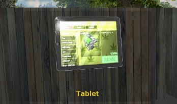

Nos pondremos la `Tablet` en la mano y pulsaremos el click derecho. Se abrirá un menú en el cual podrás comprar todos los materiales necesarios.

Para poder empezar, necesitarás:
- 1 Generador.
- 2 Bidones de Gasolina.
- 1 Lámpara de Sodio.
- 2 Ventiladores.
- 1 Alargador de Cables.
- 2 Macetas.
- Bolsas de Tierra (Una por cada maceta).
- 1 Regadera.
- 1 Tanque de Agua.
- 1 Estación de Secado.
- 1 Tabla de Empaquetado.

> Las cantidades podrán variar según la cantidad de Marihuana que quieras producir.

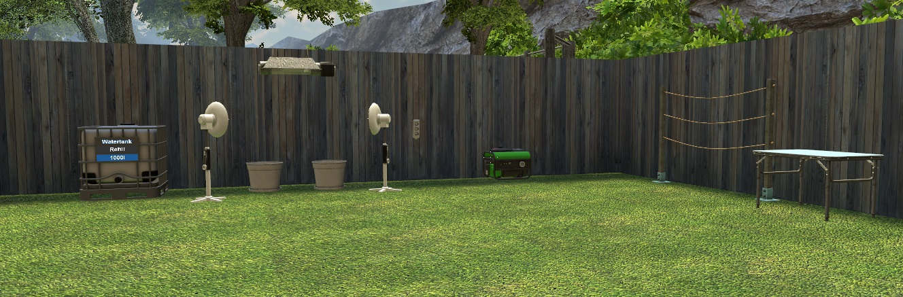

## Preparación del Generador
Una vez comprados todos los materiales necesarios, tendrás que llenar el `Generador` con los 2 `Bidones de Gasolina`. Para ello, tendrás que arrastrarlos hasta el `Generador`.

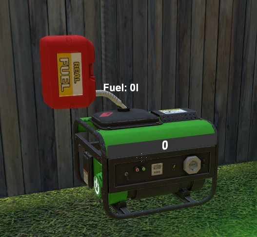

## Cableado
Ahora tendrás que conectar todos los aparatos con el `Generador`. Selecciona el `Cable` con la rueda del ratón, pulsa click izquierdo mirando hacia el `Generador` y a continuación click izquierdo en el `Alargador`.

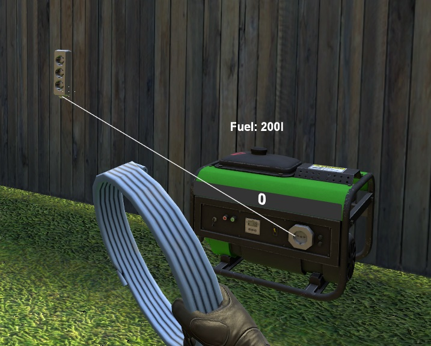

Después, conecta el `Alargador` con la `Lámpara de Sodio` y los dos `Ventiladores`.

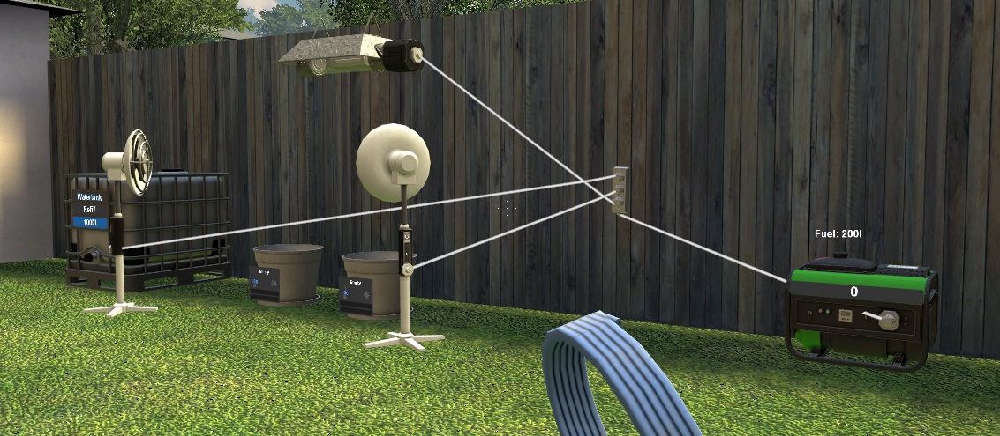

## Preparación de las Macetas
Para preparar las `Macetas`, tendrás que llenarlas con las `Bolsas de Tierra`. Para ello, coloca encima de cada `Maceta` una `Bolsa de Tierra`.

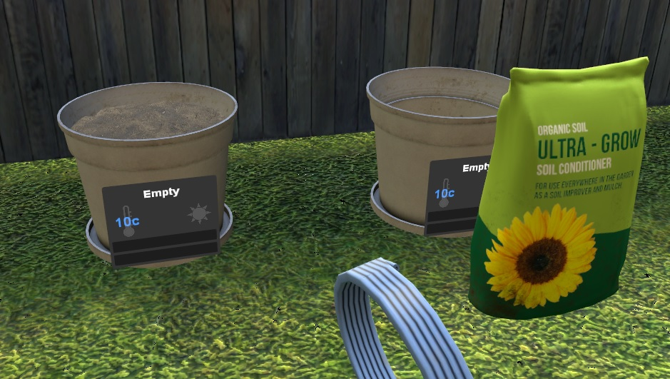

## Conexión del Circuito
Acércate al `Generador` y pulsa el botón de encendido. También tendrás que encender el resto de aparatos eléctricos como la `Lámpara de Sodio` y los `Ventiladores`.

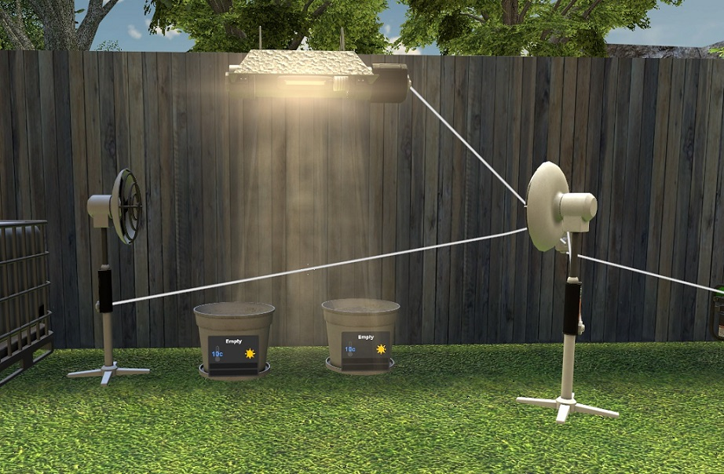

> Recuerda apagar todo el sistema para ahorrar en combustible!

## Plantado de las Semillas
En la `Tablet` encontrarás una gran variedad de `Semillas`, cada una tendrá unas cualidades mejores que las hará mejores que otras.

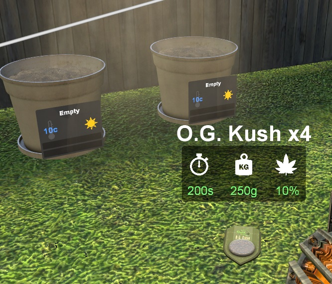

Compra una `Semilla` e introdúcela dentro de la `Maceta` para plantarla.

## Mantenimiento de la Planta
Para mantener viva la `Planta`, tendrás que regarla para mantenerla en su nivel de agua adecuado.

Usa la `Regadera`, pulsando click izquierdo en la `Maceta`. Además de regar la `Planta`, tendrás que vigilar que la `Lámpara de Sodio` ilumine y caliente la `Planta` correctamente.

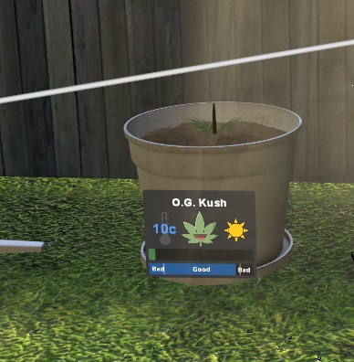

> Recuerda que si riegas la `Planta` demasiado, se sobrehidratará y podrá morir!

Para rellenar la `Regadera`, pulsa click derecho mirando hacia el `Tanque de Agua`.

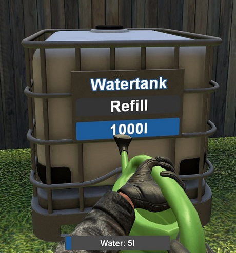

> Si te quedas sin agua en el `Tanque de Agua`, podrás rellenarlo pulsando E.

Si quieres, puedes comprar `Fertilizantes` para aumentar las cualidades de la `Planta`. Podrás comprarlos en la `Tablet`.

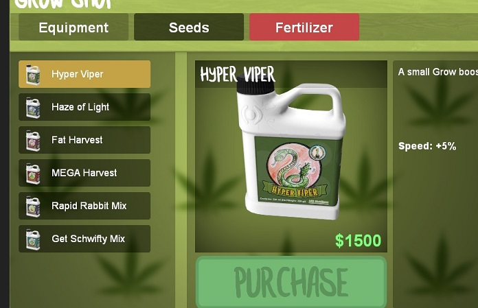

## Enfermedades en la Planta
Cada cierto tiempo, las `Plantas` pueden infectarse. Tendrás que estar atento y pulsar E en la planta para curarla.

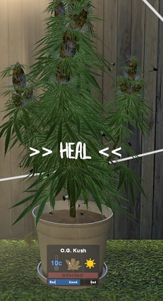

## Cosecha de la Planta
Una vez la `Planta` ha crecido lo suficiente, podrás cosecharla pulsando la tecla E.

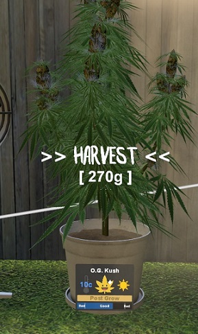

## Procesamiento de la Planta
Una vez cosechada, obtendrás los `Cogollos` de la `Planta`.

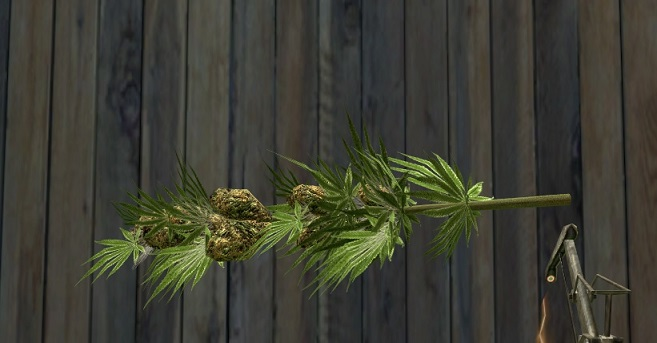

Tendrás que llevar los `Cogollos` a la `Estación de Secado`.

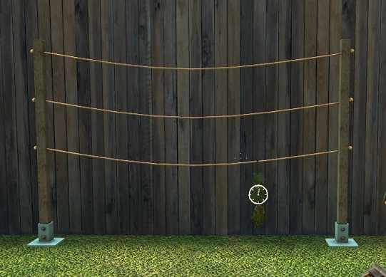

> Tendrás que esperar un tiempo a que se seque y poder seguir con el procesamiento!

Una vez se haya secado, pulsa la tecla E y obtendrás un `Tarro`.

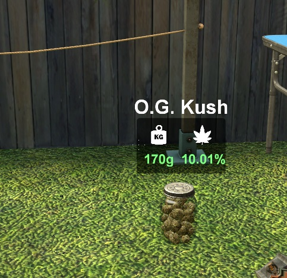

## Empaquetamiento de la Marihuana
Cuando obtengas cuatro `Tarros`, colócalos encima de la `Tabla de Empaquetado`. Podrás pulsar la E para empaquetar los `Tarros` en un `Bloque de Marihuana` para su posterior venta.

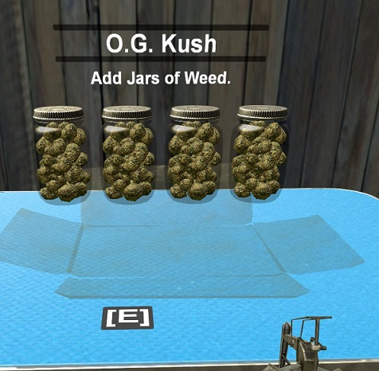

## Venta de la Marihuana
Cuando quieras vender uno o varios `Bloques de Marihuana`, pulsa la tecla E para guardar un `Bloque de Marihuana` para transportarlo.

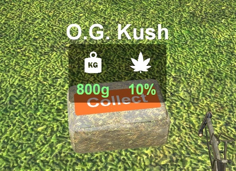

Para finalizar, tendrás que buscar un `Comprador de Marihuana` y venderselo.

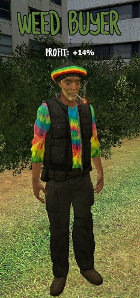