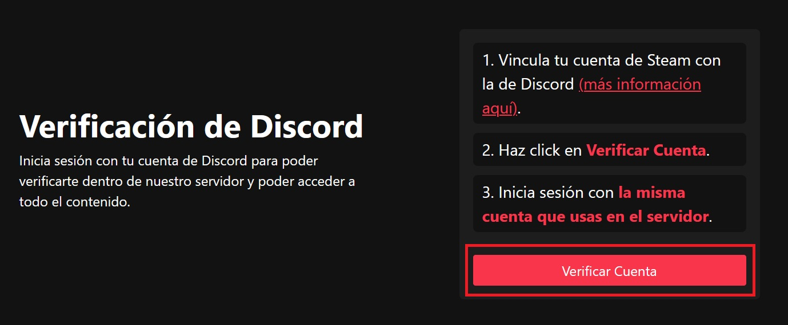
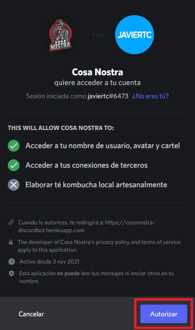

# Verificación de la Cuenta
Una vez hayas entrado al servidor de Discord, te encontrarás con esto:

Para poder acceder al resto del servidor, **tendrás que verificar tu cuenta siguiendo estos pasos:**

## Conexión Steam con Discord
Lo primero que tendrás que hacer es **enlazar tu cuenta de Steam con la cuenta de Discord**. Para ello:
- Abre Discord, dirígete a la parte inferior izquierda y haz click en el `engranaje ⚙️`.

- En la parte superior izquierda, en `Ajustes de Usuario`, selecciona la categoría `Conexiones`.

- En la parte superior, aparecerá una serie de redes sociales/aplicaciones web, tendrás que pulsar el `Icono de Steam` e iniciar sesión con tu cuenta de Steam.

Una vez realizado todos estos pasos, **habrás enlazado tu cuenta de Steam correctamente!**

## Verificación del Usuario
Teniendo tu cuenta de Discord **enlazada con Steam**, ahora **tendrás que verificar tu cuenta de Discord:**
- Dirígete a [esta página web](https://gmodrepublic.es/verificar/).
- Pulsa `Verificar Cuenta` en la esquina superior derecha.

- Inicia sesión con tu `cuenta de Discord`, y haz click en Autorizar.

> Asegúrate que tu cuenta es la misma que estás usando en el servidor de Discord!

**Ya has verificado tu cuenta de Discord!** Ahora solo tendrás que esperar unos segundos a que el bot compruebe la información y te otorgue el rango de Usuario.